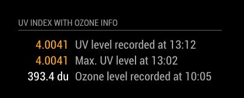

# MMM-UVData
Additional Module for MagicMirror²  https://github.com/MichMich/MagicMirror

Under Beta

#Module: UVData
This module displays current and max UV levels for a given latitude & longditude from https://www.openuv.io



##Using the module

Git clone from this repository into the modules sub-directory of the Magic Mirror installation, change directory into the newly cloned code and then run npm install.

```bash
git clone https://github.com/nwootton/MMM-UVData.git
cd MMM-UVData
npm install
```
To use this module, add it to the modules array in the `config/config.js` file:

```javascript
modules: [
    {
		module: 		'MMM-UVData',
		position: 		'bottom_left',
		header:			'UV Levels For Today',		//Optional - delete this line to turn OFF the header completely
		config: {
			lat: 	    'SUR', 		// Latitude
			lng: 	    '', 		// Longditude
			alt: 		'', 		// Optional - altitude in m. If not supplied will default to 0m or sea level
			api_key: 	''   	    //OpenUV API access key
		}
	},
]
```
There are 3 MANDATORY fields - `lat`, `lng` and `api_key`.

Please see the OpenUV API documentation [here](https://www.openuv.io/)

|Option|Required Settings Description|
|---|---|
|`lat`|Numeric. The latitude of the location for the UV measurement<br><br>This value is **REQUIRED** <br/>**Example**: 51.508 <br /> |
|`lng`|Numeric. The longditude of the location for the UV measurement<br><br>This value is **REQUIRED**  <br/>**Example**: -0.1617 <br />|
|`api_key`|String. Your OpenUV API api_key [Get yours here](https://www.openuv.io/).<br><br>This value is **REQUIRED** <br/>**Example**: z9307fd87b0000c107e098d5effedc97 <br />|

|Option|Optional Settings Description|
|---|---|
|`alt`|Numeric. Altitude in metres of the location for the UV measurement. If NOT supplied the API will assume 0m (sea level).<br><br>**Example:** '22.4'|
|`showOzone`|Boolean. Display Ozone levels measured in Dobson Units (du). <br><br>**Default:** true|

## OpenUV API

To setup an account for the Api_key sign up for an account here: https://www.openuv.io/

## Troubleshooting

If there are issue getting data out of the module I'm ALWAYS going to ask the following:

1. Do you have an account set up at OpenUV.io
2. Do you have an api_key set up?
3. Do you know the Lat & Long for the location?
4. If you use the live api documentation [here](https://www.openuv.io/uvindex#) and put in the info you want to use does it respond without an error?
5. Is the info in your config the same as that you’ve used successfully in the live api docs?
6. Include the lat, long & alt in the report.
